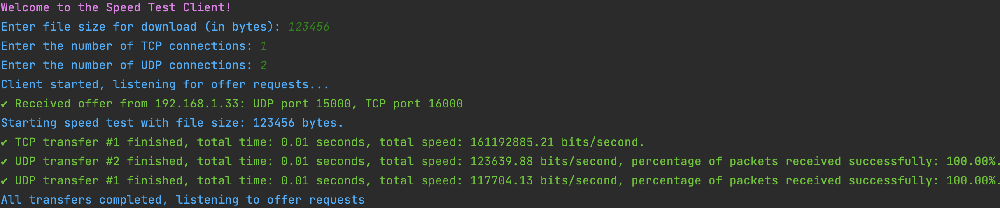

# Server-Client Network Speed Test 🚀


👩‍💻 **Ron Shukrun** 
👨‍💻 **Maor Nezer**

---

This project consists of a server and client designed to measure and report network speed using both TCP and UDP protocols. The server broadcasts its availability via UDP and accepts requests over both UDP and TCP to test the download speed. The client listens for the server's offer and performs file download tests using both UDP and TCP, reporting transfer times and speeds.

---

## Server 🖥️ :

The server listens for incoming connections on specified ports and handles UDP and TCP download requests. It broadcasts its availability over UDP, and the client can request file data over both protocols.

### Server Features:
* Broadcasts server availability using UDP every second
* Listens for UDP requests and sends file data in segments
* Accepts TCP connections and sends file data in chunks
* Provides a progress report on data transfer completion

---

## Client 👤 :

The client listens for UDP offers from the server, retrieves server information, and performs file download tests over both UDP and TCP.

### Client Features:
* Listens for UDP broadcasts from the server
* Connects to the server using UDP and TCP to download data
* Reports download times and network speeds in bits per second

###  📈 Statistical information:
* Download speed in Mbps for TCP and UDP connections
* Packet loss rate during tests
* Latency time for each connection type (TCP/UDP)

---

## Usage Instructions 🔎 :

### 🏃‍➡️ How to Run the Project:
* Python 3.x
1. Run the server:
* Launch the server application first. The server will start broadcasting its 
* Server Setup:
```bash
python server.py
```
* The server will listen on ports 15000 (UDP) and 16000 (TCP).

2. Run the client:
* Launch the client application after starting the server. The client will listen for UDP broadcasts from the server.
* Client Setup:
```bash
python client.py
```
* Once the server's offer is detected, the client will perform download tests using both UDP and TCP and report the results.


### 💬 Example Output:
* Server (Console): 

    
* Client (Console):

    

### 📋 Notes:
📌 The server's UDP broadcast will occur every second.

📌 The client will automatically connect to the server once it detects the broadcast.

📌 You can modify the buffer size and timeout configurations in the source code for testing different network conditions.

---